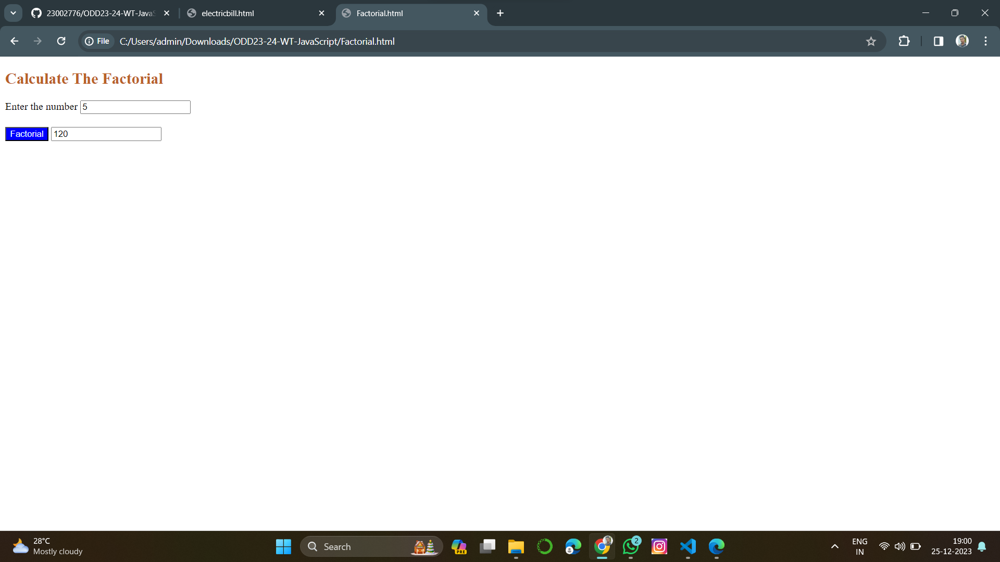
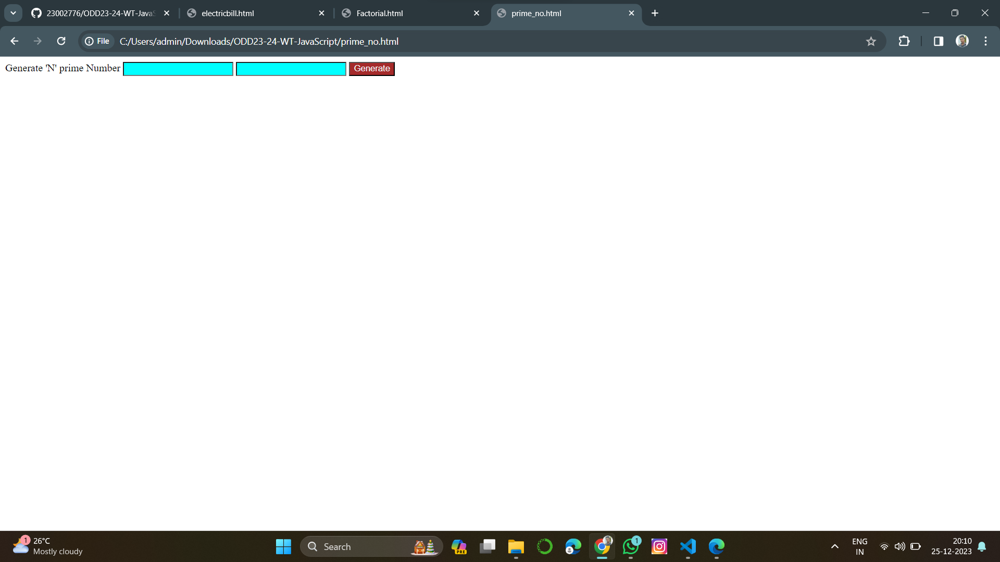
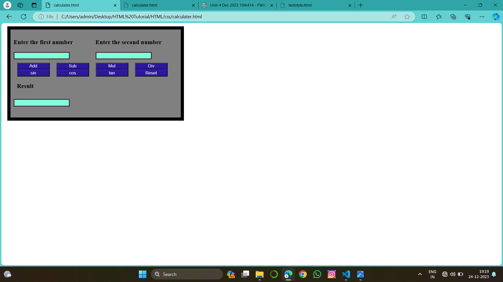
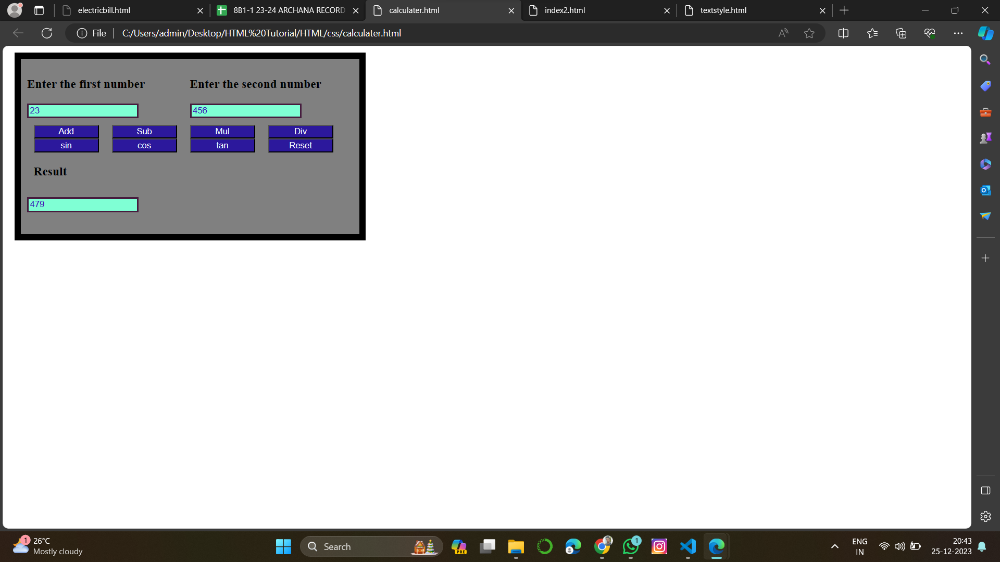
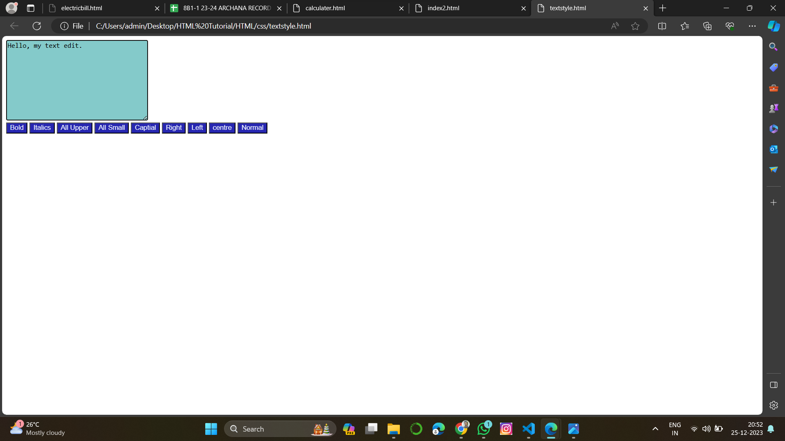
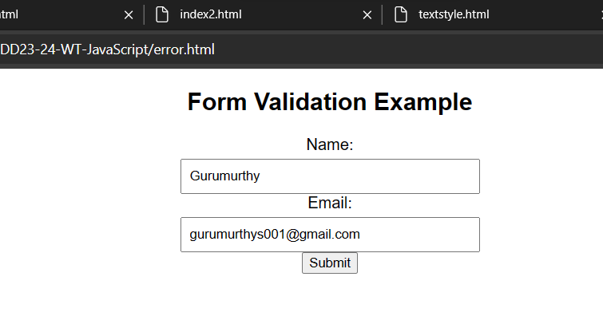
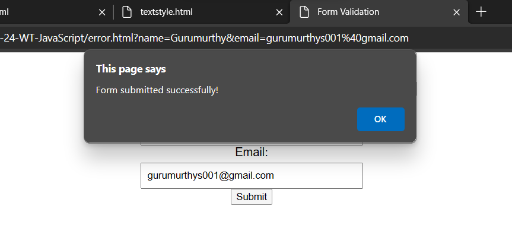

# ODD23-24-WT-JavaScript

# Ex:09 JavaScript
Name: GURRMURTHY S
Reg.No: 212223230066
# PROGRAM-1:
# AIM:
To create a form with java script code to calculate electricity bill.

# PROCEDURE:
Step 1:
Initialize a variable result to 1. This will hold the final factorial value.

Step 2:
Start a loop from 2 to the given number n.

Step 3:
In each iteration of the loop, multiply the current number i with result and update result.

Step 4:
After the loop ends, result will hold the factorial of n. Return result.

# PROGRAM:
```html
<!DOCTYPE html>
<html>
    <head>
        <script type="text/javascript">
            function ebill()
            {
                var pre,now,units,amt;
                pre = Number(document.getElementById("pre").value);
                now = Number(document.getElementById("new").value);
                units = now-pre;
                if(units<=100)
                {
                    amt=100;
                }
                else if(100<=units && units<=300)
                {
                    amt=100+(units-100)*3;
                }
                else
                {
                    amt=100+600+(units-300)*5;
                }
                document.getElementById("ans").value=amt;

            }
        </script>
        <style>
            #pre{
                background-color: aquamarine;
            }
            #new{
                background-color: aqua;
            }
            #ans
            {
                background-color: bisque;
            }
            #button{
                background-color: blue;
                color: white;
            }
            .contain{
                display: grid;
                grid-template-columns: 1fr 1fr;
            }
            .result
            {
                display: flex;
                padding-top: 25px;
            }
            .result2{
                padding-left: 25px;
              
            }
        </style>
    </head>
    <body>
        <h2 >Electricity Bill Calculator</h2>
        <form>
            <div class="contain">
                <div>
                    <h3>Enter Previous Reading</h3>
                    <input type="text" id="pre">
                </div>
                <div>
                    <h3>Enter Current Reading</h3>
                    <input type="text" id="new">
                </div>
            </div>
            <div class="result">
                <div id="buttonres">
                <input type="button" id="button" onclick="ebill()" value="Genrate Bill"></div>
                <div class="result2"><input type="text" id="ans"></div>
            </div>
        </form>
    </body>
</html>
```
# OUTPUT:


# RESULT:
Thus the java code executed to calculate the electricity bill.

# PROGRAM-2:
# AIM:
To create a form with java script code to compute the factorial of a given number without recursion.

# PROCEDURE:
Step 1:
Initialize a variable result to 1. This will hold the final factorial value.

Step 2:
Start a loop from 2 to the given number n.

Step 3:
In each iteration of the loop, multiply the current number i with result and update result.

Step 4:
After the loop ends, result will hold the factorial of n. Return result.

# PROGRAM:
```html
<!DOCTYPE html>
<html>
    <head>
        <script type="text/javascript">
            function fact()
            {
                var num,i,fact=1;
                num=Number(document.getElementById("num1").value);
                for(i=1;i<=num;i++)
                {
                    fact=fact*i;
                }
                document.getElementById("result").value=fact;
            }
        </script>
        <style>
            .contain{
                display: grid;
                grid-template-rows: 1fr 1fr;
            }
            #result1{
                padding-top: 10px;
            }
            .button{
                background-color: blue;
                color: aliceblue;
            }
            h2{
                color: rgb(185, 97, 39);
            }
        </style>
    </head>
    <body>
        <h2>Calculate The Factorial</h2>
        <form>
            <div class="contain">
            <div>Enter the number
            <input type="text" id="num1"></div>
            <div id="result1"><input type="button"class="button"  onclick="fact()" value="Factorial">
            <input type="text" id="result"></div>
            </div>
        </form>
    </body>
</html>
```
# OUTPUT:


# RESULT:
Thus the java code executed to compute the factorial of a given number without recursion.

# PROGRAM-3:
# AIM:
To construct a JavaScript code to generate ‘N’ prime numbers.

# PROCEDURE:
Step 1:
Initialize a count variable to keep track of the number of prime numbers generated.

Step 2:
Start from the number 2 (the first prime number), and for each number, check if it is prime.

Step 3:
If the number is prime, increment the count and print the number.

Step 4:
Repeat steps 2 and 3 until ‘N’ prime numbers have been generated.


# PROGRAM:
```html
<html>
    <head>
        <script type="text/javascript">
            function show()
            {
                var low=Number(document.getElementById("n1").value);
                var high=Number(document.getElementById("n2").value);
                var i,j;
                for(i=low;i<=high;i++) 
                    {
                    var flag=0;
                    for(j=2;j<i;j++) 
                        {
                        if(i%j==0) 
                            {
                            flag=1;
                            break;
                            }
                        }
                    if(flag==0&&i>1) 
                    alert(i);
                    }
            }
        </script>
    </head>
    <body>
        <form>
            Generate 'N' prime Number<br>
            <input type="text" id="n1">
            <input type="text" id="n2">
            <input type="button" onclick="show()" value="Generate"><br>
        </form>
    </body>
</html>
```
OUTPUT:


# RESULT:
Thus the java code executed to construct a JavaScript code to generate ‘N’ prime numbers.

# PROGRAM-4:
# AIM:
To construct a JavaScript program to implement a simple calculator.

# PROCEDURE:
Step 1:
Define a function for each operation (addition, subtraction, multiplication, division) that takes two numbers as input and returns the result of the operation.

Step 2:
Define a function calculate that takes three parameters: two numbers and an operator.operation function based on the operator provided.

Step 3:
Call the calculate function with the numbers and operator as arguments to perform a calculation.

Step 4:
Print the result of the calculation.

# PROGRAM:
```html
<!DOCTYPE html>
<html>
    <head>
        <script type="text/javascript">
            function f1()
            {
                var n1=Number(document.getElementById("num1").value);
                var n2=Number(document.getElementById("num2").value);
                document.getElementById("result").value=n1+n2;
            }
            function f2()
            {
                var n1=Number(document.getElementById("num1").value);
                var n2=Number(document.getElementById("num2").value);
                document.getElementById("result").value=n1-n2;
            }
            function f3()
            {
                var n1=Number(document.getElementById("num1").value);
                var n2=Number(document.getElementById("num2").value);
                document.getElementById("result").value=n1*n2;
            }
            function f4()
            {
                var n1=Number(document.getElementById("num1").value);
                var n2=Number(document.getElementById("num2").value);
                document.getElementById("result").value=n1/n2;
            }
            function f5()
            {
                var n1=Number(document.getElementById("num1").value);
                var n2=Number(document.getElementById("num2").value);
                document.getElementById("result").value=Math.sin(n1);
            }
            function f6()
            {
                var n1=Number(document.getElementById("num1").value);
                var n2=Number(document.getElementById("num2").value);
                document.getElementById("result").value=Math.cos(n1);
            }
            function f7()
            {
                var n1=Number(document.getElementById("num1").value);
                var n2=Number(document.getElementById("num2").value);
                document.getElementById("result").value=Math.tan(a);
            }
            function f8()
            {
                var n1=Number(document.getElementById("num1").value=" ");
                var n2=Number(document.getElementById("num2").value=" ");
                document.getElementById("result").value=" ";

            }

        </script>
        <style>
            .button{
                display: grid;
                grid-template-columns: 1fr 1fr 1fr 1fr;
                padding: 10px;
            }
            .input{
                display:grid;
                grid-template-columns: 1fr 1fr;
                align-items: center;
            }
            #contain{
                padding: 10px;
                background-color: gray;
                height: 250px;
                width: 500px;
                border: 10px solid black;
                margin: 10px;

            }
            .button2{
                background-color: rgb(44, 24, 156);
                color: aliceblue;
                width: 100px;
                
            }
            .onec,.twoc,.threec{
                background-color: aquamarine;
                border: 3px solid rgb(70, 28, 62);
                color: rgb(61, 16, 184);
            }
        </style>
       
      
    </head>
    <body>
        <div id="contain">
            <div class="input">
                <div class="inpone">
                    <h3>Enter the first number</h3>
                    <input type="text" id="num1" class="contain onec">
                </div>
                <div class="inptwo">
                    <h3>Enter the second number</h3>
                    <input type="text" id="num2" class="contain twoc">
                </div>
            </div>
                
            <div class="button">
                <div><input type="button" onclick="f1()" value="Add" class="button2"></div>
                <div><input type="button" onclick="f2()" value="Sub" class="button2"></div>
                <div><input type="button" onclick="f3()" value="Mul" class="button2"></div>
                <div><input type="button" onclick="f4()" value="Div" class="button2"></div>
                <div><input type="button" onclick="f5()" value="sin" class="button2"></div>
                <div><input type="button" onclick="f6()" value="cos" class="button2"></div>
                <div><input type="button" onclick="f7()" value="tan" class="button2"></div>
                <div><input type="button" onclick="f8()" value="Reset" class="button2"></div>
                <h3>Result</h3>
            </div>
                <div><input type="text" id="result" class="contain threec"></div>
            </div>
        </div>
    </body>
</html>
```

# OUTPUT:



# RESULT:
Thus the java code executed to implement a simple calculator.

# PROGRAM-5:
# AIM
Design a simple text editor JavaScript application where we can manipulate the user input in different styles, edit the input, capitalize, and many string operations.

# PROCEDURE:
Step 1:
User enters the text in the text area.

Step 2:
User clicks on one of the buttons to perform an operation (capitalize, lowercase, reverse).

Step 3:
The JavaScript function corresponding to the operation is executed. This function gets the text from the text area, performs the operation, and updates the result paragraph with the new text.

Step 4:
The result is displayed on the webpage. The user can perform more operations or enter new text. The process repeats from Step 2.

# PROGRAM:
```html
<!DOCTYPE html>
<html>
    <head>
        <script type="text/javascript">
            function f1()
            {
                document.getElementById("text").style.fontWeight="bold";
            }
            function f2()
            {
                document.getElementById("text").style.fontStyle="italic";
            }
            function f3()
            {
                document.getElementById("text").style.textTransform="uppercase";
            }
            function f4()
            {
                document.getElementById("text").style.textTransform="lowercase";
            }
            function f5()
            {
                document.getElementById("text").style.textTransform="capital";
            }
            function f6()
            {
                document.getElementById("text").style.textAlign="right";
            }
            function f7()
            {
                document.getElementById("text").style.textAlign="left";
            }
            function f8()
            {
                document.getElementById("text").style.textAlign="centre";
            }
            function f9()
            {
                document.getElementById("text").style.fontStyle="normal";
                document.getElementById("text").style.fontWeight="normal";
                document.getElementById("text").style.textAlign="left";
            }
        </script>
        <style>
            textarea{
                background-color: rgb(132, 202, 202);
            }
            .button{
                background-color: rgb(39, 39, 177);
                color: aliceblue;
            }
        </style>
    </head>
    <body>
        <form>
            <textarea rows="10" cols="35" id="text"></textarea><br>
            <input type="button" class="button" onclick="f1()" value="Bold">
            <input type="button" class="button" onclick="f2()" value="Italics">
            <input type="button"class="button" onclick="f3()" value="All Upper">
            <input type="button" class="button" onclick="f4()" value="All Small">
            <input type="button" class="button" onclick="f5()" value="Captial">
            <input type="button" class="button" onclick="f6()" value="Right">
            <input type="button" class="button" onclick="f7()" value="Left">
            <input type="button" class="button" onclick="f8()" value="centre">
            <input type="button" class="button" onclick="f9()" value="Normal">
            
        </form>
    </body>
</html>
```

# OUTPUT:

.png>)
.png>)
.png>)
.png>)
.png>)

# RESULT:
Thus the java code executed to design a simple text editor JavaScript application where we can manipulate the user input in different styles, edit the input, capitalize, and many string operations.

# PROGRAM-6:
# AIM:
To design a JavaScript program which displays error messages when a field in form is entered incorrectly.

# PROCEDURE:
Step-1:
Start define the document as HTML.

Step-2:
Open the HTML structure with necessary head and body .Give the script type as text/javascript.

Step-3:
Define the function for the program as validate().

Step-4:
Give the necessary input that is required to design a JavaScript program which displays error messages when a field in form is entered incorrectly.Get the number for input using document.getElementById.

Step-5:
Using for-loop condition and if-else condition displays error messages when a field in form is entered incorrectly. Close the script and head tags.

Step-6:
Give the input type in the body of the HTML.

Step-7:
End the HTML structure.

# PROGRAM:
```html
<!DOCTYPE html>
<html lang="en">
<head>
  <meta charset="UTF-8">
  <meta name="viewport" content="width=device-width, initial-scale=1.0">
  <title>Form Validation</title>
  <style>
    body {
      font-family: Arial, sans-serif;
      text-align: center;
    }
    form {
      width: 300px;
      margin: 20px auto;
    }
    label {
      display: block;
      margin-bottom: 5px;
    }
    input {
      width: 100%;
      padding: 8px;
      margin-bottom: 10px;
      box-sizing: border-box;
    }
    .error {
      color: red;
      font-size: 14px;
      margin-top: -10px;
    }
  </style>
</head>
<body>

  <h2>Form Validation Example</h2>

  <form onsubmit="return validateForm()">
    <label for="name">Name:</label>
    <input type="text" id="name" name="name">
    <div id="nameError" class="error"></div>

    <label for="email">Email:</label>
    <input type="text" id="email" name="email">
    <div id="emailError" class="error"></div>

    <button type="submit">Submit</button>
  </form>

  <script>
    function validateForm() {
      var nameInput = document.getElementById('name');
      var emailInput = document.getElementById('email');
      var nameError = document.getElementById('nameError');
      var emailError = document.getElementById('emailError');

      // Reset error messages
      nameError.innerHTML = '';
      emailError.innerHTML = '';

      // Validate Name
      if (nameInput.value.trim() === '') {
        nameError.innerHTML = 'Name is required.';
        return false;
      }

      // Validate Email
      var emailRegex = /^[^\s@]+@[^\s@]+\.[^\s@]+$/;
      if (!emailRegex.test(emailInput.value.trim())) {
        emailError.innerHTML = 'Invalid email address.';
        return false;
      }

      // If validation passes, you can submit the form
      alert('Form submitted successfully!');
      return true;
    }
  </script>

</body>
</html>
```
# OUTPUT:



# Result:
Thus the java code executed to design a JavaScript program which displays error messages when a field in form is entered incorrectly.